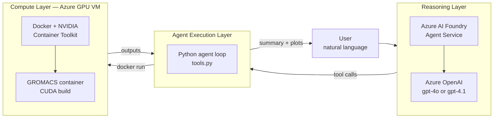

# AI Agents as Aid to HPC — AgentCon Demo

> **Core message:** Agents are not replacing HPC systems. They are simplifying access to them by acting as orchestration layers.

This repo is a minimal, end-to-end reference implementation of an AI-agent-driven scientific computing workflow on Azure. A user types a natural-language request like

> *"Run a short molecular dynamics simulation of lysozyme in water."*

…and a small Python agent — backed by Azure AI Foundry Agent Service — interprets the intent, calls a fixed set of tools to drive a containerized GROMACS pipeline on an Azure GPU VM, monitors the run, parses outputs, and returns an RMSD/energy plot plus a short scientific summary.

The point is **not** to demonstrate autonomy or distributed scheduling. It is to demonstrate a **thin, reliable orchestration layer** that hides HPC-style ceremony (file prep, container plumbing, tool chaining, output parsing) behind a conversational interface.

---

## What this is — and is not

This demo **is**:
- A constrained, single-VM agent that drives a real, GPU-accelerated GROMACS run.
- Reproducible: everything runs inside a pinned Docker image.
- Deterministic in shape: the agent picks from a fixed tool surface, not free-form code execution.
- Live-demo friendly: the production MD step is sized to ~20–40 seconds on a T4/A10 GPU.

This demo is **not**:
- A Slurm replacement, a job-scheduler integration, or a multi-node orchestrator.
- A general-purpose autonomous research agent.
- Production HPC infrastructure. There is no queue, no quota system, no multi-tenant isolation.

---

## GPU vendor selection

This repo supports three compute substrates behind the same agent and tool surface, selected with the `GPU_VENDOR` env var:

| `GPU_VENDOR` | VM family | Setup script | Container build |
|---|---|---|---|
| `amd` (primary, given your `NV8as_v4` quota) | `NV*as_v4` (AMD MI25) | `infra/setup-vm-amd.sh` | `docker build -f container/Dockerfile.rocm -t gromacs-demo:rocm container/` |
| `nvidia` | `NC*_T4_v3`, `NV*_A10` | `infra/setup-vm.sh` | `docker build -t gromacs-demo:cuda container/` |
| `cpu` (safety net) | any | `infra/setup-vm-cpu.sh` | `docker build -f container/Dockerfile.cpu -t gromacs-demo:cpu container/` |

**Important:** the AMD path on `NV*as_v4` is not officially supported by Azure for compute (the family is marketed for visualization). Whether ROCm can actually see the MI25 partition through the MxGPU layer is the open question — `infra/setup-vm-amd.sh` reports honestly whether `rocminfo` finds it. If it doesn't, fall back to `GPU_VENDOR=cpu` for the demo (90–180 s production MD on 8 vCPU) or request NVIDIA `NC4as_T4_v3` quota. The full discussion is in [`docs/gpu-vendors.md`](docs/gpu-vendors.md).

The agent does not change between paths. Only the image tag and the `GPU_VENDOR` variable change.

## Repo layout

```
agentcon-hpc-demo/
├── README.md                       # this file
├── docs/
│   ├── architecture.md             # architecture + diagrams + design rationale
│   ├── demo-runbook.md             # pre-talk + on-stage script + fallbacks
│   ├── tool-calling-flow.md        # example end-to-end tool-call trace
│   └── gpu-vendors.md              # AMD / NVIDIA / CPU paths, NV8as_v4 notes
├── infra/
│   ├── provision-vm.sh             # azure-cli: create RG, GPU VM, NSG, MI
│   ├── setup-vm.sh                 # on-VM: Docker + NVIDIA Container Toolkit
│   ├── setup-vm-amd.sh             # on-VM: Docker + AMDGPU/ROCm stack
│   ├── setup-vm-cpu.sh             # on-VM: Docker only (safety-net / CPU path)
│   └── teardown.sh                 # delete RG when done
├── container/
│   ├── Dockerfile                  # CUDA / NVIDIA GROMACS image
│   ├── Dockerfile.rocm             # ROCm / AMD MI25 GROMACS image (SYCL via AdaptiveCpp)
│   ├── Dockerfile.cpu              # CPU-only GROMACS image (safety net)
│   └── entrypoint.sh
├── workflow/
│   ├── _runtime.sh                 # sourced helper: docker/mdrun args per GPU_VENDOR
│   ├── run_stage.sh                # thin wrapper around gmx grompp/mdrun per stage
│   ├── prepare_system.sh           # fetch PDB, pdb2gmx, solvate, ions
│   ├── analyze.py                  # RMSD + potential energy plots, JSON summary
│   └── mdp/
│       ├── ions.mdp
│       ├── minim.mdp
│       ├── nvt.mdp
│       └── md.mdp                  # short production: ~50 ps
├── agent/
│   ├── agent.py                    # Foundry Agent Service main loop
│   ├── tools.py                    # tool implementations (shell out to workflow/)
│   ├── prompts.py                  # system prompt
│   ├── requirements.txt
│   └── .env.example
└── examples/
    └── sample_prompts.md           # prompts that work on stage
```

---

## The four layers, in one diagram



The reasoning layer never touches the compute layer directly. It only emits structured tool calls. The agent layer is the only thing that runs commands. That separation is the whole point of the design.

---

## Quickstart

You need: an Azure subscription with quota for one GPU VM (e.g. `Standard_NC4as_T4_v3` or `Standard_NV6ads_A10_v5`), Azure CLI logged in, and an Azure AI Foundry project with a deployed chat model.

```bash
# 1. Provision the VM (creates RG, VM, NSG; opens SSH only to your IP)
./infra/provision-vm.sh

# 2. SSH in, then run the on-VM setup
ssh azureuser@<vm-ip>
curl -fsSL https://raw.githubusercontent.com/<your-fork>/main/infra/setup-vm.sh | bash

# 3. Build the GROMACS container (one-time; ~10 min on the VM)
cd ~/agentcon-hpc-demo/container
docker build -t gromacs-demo:latest .

# 4. Configure the agent
cd ~/agentcon-hpc-demo/agent
cp .env.example .env
# edit .env with your Foundry connection string + model deployment name
pip install -r requirements.txt

# 5. Run the agent. Type a prompt; watch it work.
python agent.py
> Run a short molecular dynamics simulation of lysozyme in water.
```

The full talk-day flow (and what to do if Wi-Fi dies) is in [`docs/demo-runbook.md`](docs/demo-runbook.md).

---

## Why these choices

| Decision | Why |
|---|---|
| **Agent runs on the VM** | Removes SSH/transport complexity from the tool layer. Tools are local shell calls. Easier to demo, easier to reason about. |
| **Single VM, no scheduler** | The talk is about the orchestration layer, not HPC ops. Adding Slurm/AKS would obscure the message. |
| **Docker, not bare-metal GROMACS** | One pinned image = reproducibility for the audience watching, and zero "it works on my VM" debugging during the talk. |
| **Fixed tool surface (~6 tools)** | The agent has discretion over *sequencing* and *parameters*, not over *what is possible*. This is the reliability story. |
| **Foundry Agent Service** | Managed thread/run lifecycle, native tool calling, traces visible in the Foundry portal — so you can show the audience the agent's reasoning. |
| **Lysozyme in water** | Classic, small (~33k atoms after solvation), runs in <1 minute on a T4, scientifically meaningful (real RMSD curve). |

See [`docs/architecture.md`](docs/architecture.md) for the longer rationale, including what was deliberately left out.
