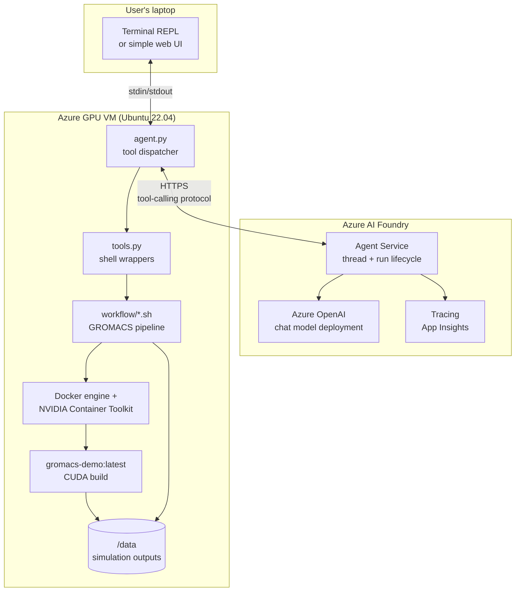

# Architecture

This document describes the system in enough detail that an engineer can rebuild it without reading the source. It is organized around the four layers — reasoning, agent execution, compute, and containerized workflow — and ends with the workflow sequence, security considerations, and future extensions.

## 1. Design goals (and non-goals)

**Goals.** Accessibility: a domain scientist who has never touched HPC tooling should be able to run a meaningful simulation by describing it. Reproducibility: identical inputs produce identical outputs across runs and machines. Reliability: the agent's discretion is bounded by a fixed tool surface; failure modes are visible. Clean layering: the reasoning model never executes shell commands; the execution layer never reasons about science.

**Non-goals.** Multi-node scheduling, queue management, fairness, autoscaling, multi-tenant isolation, autonomous research planning, or anything resembling a Slurm replacement. We deliberately stay on a single VM with a single user.

## 2. Architecture overview



### What lives where

| Component | Runs on | Stateful? | Notes |
|---|---|---|---|
| Foundry Agent + chat model | Azure-managed | Per-thread state in Foundry | Speaker doesn't operate it |
| `agent.py` | GPU VM | In-memory only | One process per session |
| Tool implementations | GPU VM | None | Shell out to `workflow/` |
| GROMACS container | GPU VM (Docker) | Writes to mounted `/data` | Pinned tag, identical every run |
| Outputs (.gro, .xtc, .edr, plots, JSON) | GPU VM `/data/run-<id>/` | Persisted on the VM disk | Cleaned by `teardown.sh` |

### Why the agent runs on the VM

There are three places the agent could plausibly live: the speaker's laptop, a separate orchestration host, or the GPU VM itself. We pick the VM because tools become local shell calls (no SSH or REST plumbing), latency is trivial, and the demo has one moving part instead of three. The cost is that the VM gets outbound HTTPS to Foundry — see §6.

## 3. Reasoning layer — Azure AI Foundry

The reasoning layer is an **Azure AI Foundry project** with a deployed chat model (`gpt-4o` or `gpt-4.1` — pick whichever is available in your region; both work). The agent uses the **Agent Service** rather than raw chat completions because:

- Threads and runs are managed for you. You don't have to track message history yourself.
- Tool calling is first-class: register a `FunctionTool`, the service handles `requires_action` polling.
- Traces show up in the Foundry portal, which is excellent for explaining the agent's reasoning to an audience after the demo.

The model only ever sees: the system prompt, the user's natural-language request, tool schemas, and tool results. It never sees credentials, file contents beyond what tools return, or shell output.

## 4. Agent execution layer

A single Python process. The shape is:

```
load env → create FunctionTool from python callables
        → create_or_get agent (with system prompt + toolset)
        → create thread
        → loop:
              read user input
              create_message(thread, "user", text)
              create_and_process_run(thread, agent)   # auto-handles tool calls
              print last assistant message
```

`create_and_process_run` is the reliability story. The Foundry SDK takes care of the tool-call ping-pong: when the model emits a `requires_action`, the SDK invokes the matching Python callable and submits the result. We don't write that loop ourselves, which means we can't get it subtly wrong.

### Tool surface

The agent has six tools. That's deliberate — small enough to enumerate, large enough that the model has real choices.

| Tool | Purpose | Input | Output |
|---|---|---|---|
| `check_environment` | Verify Docker, GPU, image | none | `{docker_ok, gpu_ok, image_present, gpu_name}` |
| `prepare_system` | Fetch PDB, pdb2gmx, solvate, ions | `pdb_id`, `force_field`, `water_model`, `box_nm` | `{run_id, n_atoms, box_size}` |
| `run_stage` | Run minimize, NVT, or production | `run_id`, `stage` ∈ {minimize, equilibrate, production}, `nsteps` | `{stage, walltime_s, final_energy}` |
| `analyze` | Compute RMSD or energy series | `run_id`, `metric` ∈ {rmsd, potential, temperature} | `{metric, plot_path, summary_stats}` |
| `get_run_status` | Tail mdrun log for in-flight runs | `run_id` | `{stage, progress_pct, eta_s}` |
| `report` | Bundle final results | `run_id` | `{plots: [paths], stats, files: [paths]}` |

The tools never return raw shell output to the model. They return structured JSON with the fields the model actually needs to make a decision. This keeps the context window usable and prevents the model from being misled by stray log lines.

## 5. Compute and containerized workflow layers

**VM.** A single Ubuntu 22.04 VM, sized `Standard_NC4as_T4_v3` (4 vCPU, 28 GB RAM, 1× T4) or `Standard_NV6ads_A10_v5` (6 vCPU, 55 GB RAM, partial A10) — the T4 is the cheaper option and is plenty for lysozyme. Boots with a managed identity that has no Azure RBAC permissions outside this experiment; the VM does not need to call Azure ARM at runtime.

**Docker stack.** Docker Engine + NVIDIA Container Toolkit. The agent runs `docker run --gpus all --rm -v /data:/data gromacs-demo:latest <cmd>` — that's the only invocation pattern.

**GROMACS container.** Built from `nvidia/cuda:12.4.1-runtime-ubuntu22.04`, with GROMACS compiled `-DGMX_GPU=CUDA`. We pin the GROMACS version (e.g. `2024.3`) and the CUDA base tag, so a rebuild a year from now produces the same simulation results within numerical tolerance. The image is built once on the VM and tagged `gromacs-demo:latest`; the agent verifies the tag exists in `check_environment` and refuses to proceed otherwise.

**Workflow scripts.** `workflow/prepare_system.sh` and `workflow/run_stage.sh` are the only things that issue `gmx` commands. The agent's tool implementations call those scripts; the scripts call `gmx` inside the container. This sandwiching means the LLM cannot synthesize arbitrary `gmx` invocations even if it tries — the `stage` argument selects from a fixed set.

**Outputs.** Each run gets `/data/run-<uuid>/` containing:

```
topology/      *.top *.itp *.gro      from prepare_system
em/            em.{tpr,gro,edr,log}   minimization
nvt/           nvt.{tpr,gro,edr,log,xtc}   equilibration
prod/          md.{tpr,gro,edr,log,xtc}    production MD
analysis/      rmsd.png energy.png summary.json
```

`analyze.py` reads `.edr` and `.xtc` via `gmx energy` / `gmx rms`, then matplotlib-renders PNGs and writes a `summary.json` the agent can return verbatim to the model.

## 6. Workflow sequence

The end-to-end happy path for the canonical prompt:

```mermaid
sequenceDiagram
    participant U as User
    participant LLM as Foundry Agent (gpt-4o)
    participant AG as agent.py (on VM)
    participant SH as workflow/*.sh
    participant GMX as GROMACS container
    participant FS as /data filesystem

    U->>LLM: "Run a short MD of lysozyme in water"
    LLM->>AG: tool: check_environment()
    AG->>SH: docker info; nvidia-smi; docker images
    SH-->>AG: ok
    AG-->>LLM: {docker_ok, gpu_ok, image_present}

    LLM->>AG: tool: prepare_system(pdb_id="1AKI", ff="oplsaa", water="spc", box=1.0)
    AG->>SH: prepare_system.sh 1AKI ...
    SH->>GMX: gmx pdb2gmx; editconf; solvate; grompp; genion
    GMX-->>FS: topology/*, em.tpr
    SH-->>AG: {run_id, n_atoms: 33012}
    AG-->>LLM: {run_id, n_atoms}

    LLM->>AG: tool: run_stage(run_id, "minimize", nsteps=5000)
    AG->>SH: run_stage.sh minimize
    SH->>GMX: gmx mdrun -deffnm em
    GMX-->>FS: em.gro, em.edr
    SH-->>AG: {stage: minimize, walltime_s: 4, final_energy: -5.4e5}
    AG-->>LLM: ...

    LLM->>AG: tool: run_stage(run_id, "equilibrate", nsteps=25000)
    Note over GMX: 50 ps NVT, ~10s on T4
    LLM->>AG: tool: run_stage(run_id, "production", nsteps=25000)
    Note over GMX: 50 ps prod, ~15s on T4

    LLM->>AG: tool: analyze(run_id, "rmsd")
    AG->>SH: analyze.py rmsd
    SH->>GMX: gmx rms -s prod/md.tpr -f prod/md.xtc
    SH-->>AG: {plot: rmsd.png, mean: 0.18 nm}
    AG-->>LLM: ...

    LLM->>AG: tool: report(run_id)
    AG-->>LLM: {plots: [...], stats: {...}}
    LLM-->>U: "I ran a 50 ps MD of 1AKI in SPC water on a T4. RMSD plateaued at ~0.18 nm — typical for an equilibrated lysozyme. Mean potential energy was -5.4×10⁵ kJ/mol. Plots in /data/run-.../analysis/."
```

Note the model decides the *order* and the *parameters* (within sane ranges enforced by tool schemas). It does not synthesize GROMACS commands.

## 7. Security considerations

Single-user demo, so this is deliberately light, but the design choices matter:

- **No long-lived secrets on the VM.** The agent authenticates to Foundry using `DefaultAzureCredential` against the VM's system-assigned managed identity. No API keys in `.env` for the demo path. (`.env.example` documents key-based auth as a fallback for laptop development.)
- **NSG only allows SSH from your IP**, not the world. The Foundry traffic is outbound HTTPS, no inbound port needed.
- **The model can only call the six registered tools.** Even if prompt injection occurred (e.g. a malicious PDB header), the worst the model can do is request another simulation. It cannot exec arbitrary shell.
- **Tool schemas validate inputs.** `nsteps` is bounded; `pdb_id` is regex-checked (`^[0-9A-Z]{4}$`); `stage` is an enum. Parameters that pass schema validation but are still nonsensical (e.g. negative box size) are caught by the workflow scripts and surface as tool errors.
- **Container runs `--rm` and is not privileged.** It has GPU access via the NVIDIA toolkit's user-mode device passthrough, not `--privileged`.
- **Outputs stay on the VM.** Nothing is uploaded anywhere. This is a single-user, ephemeral environment.

For a productionized version, the obvious next steps are: separate the agent from the compute (so the agent has no shell on the VM), put outputs in immutable blob storage, add per-tenant identity, and rate-limit tool calls. None of those are needed for the talk.

## 8. Failure modes and what the audience sees

| Failure | What happens | What the audience sees |
|---|---|---|
| GPU not visible to Docker | `check_environment` returns `gpu_ok=false` | Agent says "GPU isn't visible — I'd need that before running MD. Want me to continue on CPU? It will take ~10 minutes." |
| PDB ID doesn't exist | `prepare_system` raises, tool returns `{error: "PDB 1ZZZ not found"}` | Agent picks an alternative or asks the user |
| mdrun crashes mid-run | Tool returns `{error, last_log_lines}` | Agent reports the failure honestly; does not retry blindly |
| Foundry transient 5xx | SDK retries; if it gives up, agent surfaces the error | Speaker re-runs |
| Network drops mid-talk | See `docs/demo-runbook.md` fallback section | Switch to recorded trace |

The point of enumerating these is that *the agent is supposed to fail gracefully*, and that visible-failure-with-honest-reporting is part of the message. An orchestration layer that pretends nothing went wrong is worse than one that says "GPU not visible."

## 9. Future extensions

Ordered by how interesting they are vs. how much they'd dilute the talk:

1. **Swap the workflow.** Replace GROMACS with OpenFOAM, LAMMPS, or NAMD. The agent layer doesn't change — only the tool implementations and the system prompt's domain framing. This is the strongest evidence that the orchestration pattern is general.
2. **Multi-VM scale-out via VMSS.** Move from one VM to a small Virtual Machine Scale Set; add a `submit_job` tool that picks an idle node. Still no Slurm. This is the most natural "next step" that a real lab would take.
3. **Real HPC backend.** Add a tool that submits to Azure CycleCloud or to an existing on-prem Slurm endpoint over SSH. Now the agent really is "in front of" an HPC system. This is the production version of the talk.
4. **Memory across runs.** Persist runs to blob storage with metadata; add a `find_previous_runs` tool. Lets the model say "I've simulated 1AKI before, here's how this compares."
5. **Multi-agent only if justified.** A "scientist" agent that chooses experiments + a "compute" agent that runs them. Don't do this for the demo — it adds complexity without paying for itself at this scale. Mention as a future direction.
6. **Cost guardrails.** Annotate each tool call with estimated wall time and $; have the agent surface a budget before long runs.

## 10. What we deliberately left out

- **Slurm / scheduler integration.** Out of scope by design; covered by extension #3.
- **Distributed orchestration (Ray, Dask, AKS).** Would require justifying multi-node, which the talk doesn't need.
- **Agentic planning frameworks (AutoGen, LangGraph multi-agent).** Adds abstraction without adding capability for this single-pipeline use case.
- **Vector store / RAG.** No knowledge retrieval is needed; the simulation domain is closed.
- **Fine-tuned models.** Off-the-shelf `gpt-4o` is more than capable of the reasoning required.

The discipline of saying no to all of these is itself the message.
